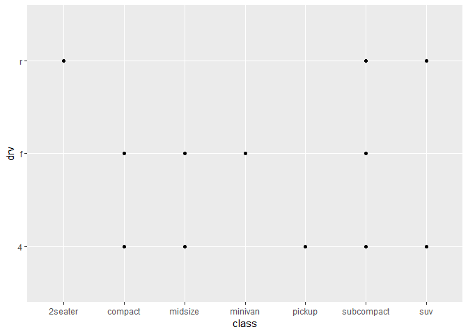
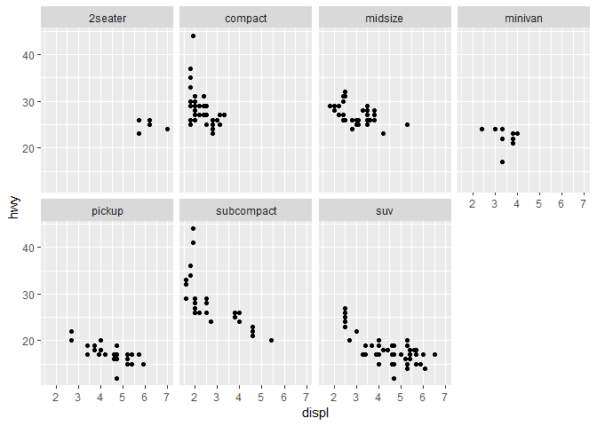
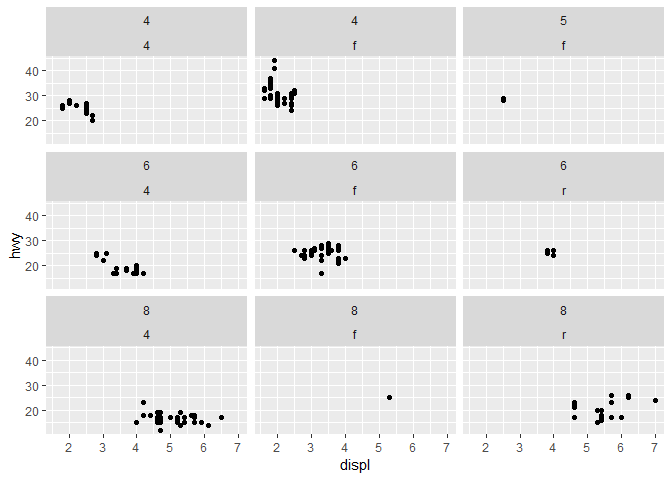

Exercícios-lista-1
================

``` r
library(tidyverse)
```

    ## -- Attaching packages ----------------------------------------------------- tidyverse 1.2.1 --

    ## v ggplot2 3.1.0       v purrr   0.3.2  
    ## v tibble  2.1.1       v dplyr   0.8.0.1
    ## v tidyr   0.8.3       v stringr 1.4.0  
    ## v readr   1.3.1       v forcats 0.4.0

    ## -- Conflicts -------------------------------------------------------- tidyverse_conflicts() --
    ## x dplyr::filter() masks stats::filter()
    ## x dplyr::lag()    masks stats::lag()

``` r
df <- mpg
```

``` r
df %>% is_tibble()
```

    ## [1] TRUE

``` r
## [1] TRUE

# equivalente a: is_tibble(df)
```

``` r
view(df)
```

``` r
df %>% ggplot(aes(x = displ, y = hwy)) +
  geom_point()
```


``` r
df %>% glimpse()
```

    ## Observations: 234
    ## Variables: 11
    ## $ manufacturer <chr> "audi", "audi", "audi", "audi", "audi", "audi", "...
    ## $ model        <chr> "a4", "a4", "a4", "a4", "a4", "a4", "a4", "a4 qua...
    ## $ displ        <dbl> 1.8, 1.8, 2.0, 2.0, 2.8, 2.8, 3.1, 1.8, 1.8, 2.0,...
    ## $ year         <int> 1999, 1999, 2008, 2008, 1999, 1999, 2008, 1999, 1...
    ## $ cyl          <int> 4, 4, 4, 4, 6, 6, 6, 4, 4, 4, 4, 6, 6, 6, 6, 6, 6...
    ## $ trans        <chr> "auto(l5)", "manual(m5)", "manual(m6)", "auto(av)...
    ## $ drv          <chr> "f", "f", "f", "f", "f", "f", "f", "4", "4", "4",...
    ## $ cty          <int> 18, 21, 20, 21, 16, 18, 18, 18, 16, 20, 19, 15, 1...
    ## $ hwy          <int> 29, 29, 31, 30, 26, 26, 27, 26, 25, 28, 27, 25, 2...
    ## $ fl           <chr> "p", "p", "p", "p", "p", "p", "p", "p", "p", "p",...
    ## $ class        <chr> "compact", "compact", "compact", "compact", "comp...

``` r
df %>% nrow()
```

    ## [1] 234

``` r
df %>% is_tibble()
```

    ## [1] TRUE

``` r
df %>% ggplot(aes(x = cyl, y = hwy)) + 
  geom_point() 
```


``` r
df %>% ggplot(aes(x = class, y = drv)) + 
  geom_point() 
```



``` r
df %>% ggplot(aes(x = displ, y = hwy)) + 
  geom_point() + 
  facet_wrap(~ class, nrow = 2)
```



``` r
df %>% ggplot(aes(x = displ, y = hwy)) + 
  geom_point() + 
  facet_wrap(vars(cyl,drv), nrow = 3)  
```


